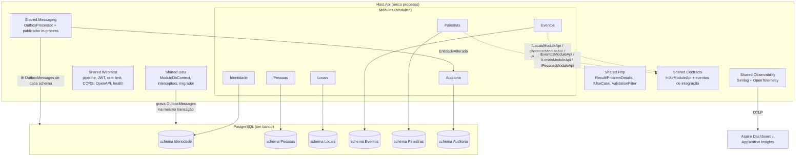

# Gestão de Eventos — Monolito Modular

Projeto modelo da palestra **"Monolito modular: construindo o futuro de forma simples"**. É uma aplicação de gestão de eventos (eventos, palestras, palestrantes, participantes, locais e salas, presença e certificados) construída como **um único deployable** com **fronteiras internas rígidas**: cada módulo tem seu schema no PostgreSQL, seus casos de uso, seu grupo de endpoints e sua telemetria, e conversa com os outros apenas por contratos explícitos. Backend em ASP.NET Core 10 + EF Core 10 + PostgreSQL 17 (`api/`), front em React + Vite + shadcn (`front/`), tudo sobe com um comando via Docker Compose.

## Por que monolito modular

- **Um deploy, uma transação, um trace.** Regras de negócio que atravessam módulos (inscrever exige pessoa e evento válidos) resolvem-se em processo, sem rede, sem sagas e sem consistência eventual onde ela não é necessária.
- **Fronteiras que o compilador fiscaliza.** Um `Module.*` só referencia `Shared.*`; nunca outro módulo. A comunicação passa por `I<X>ModuleApi` (síncrona) ou eventos de integração via Outbox (assíncrona), ambos em `Shared.Contracts`.
- **Dados isolados desde o dia um.** Um schema por módulo, `__EFMigrationsHistory` por schema, tabela `OutboxMessages` por schema e nenhuma FK cruzando módulos: o banco já está pronto para ser dividido.
- **Custo operacional de um serviço.** Uma imagem, um pipeline, um dashboard, um banco. Observabilidade, segurança e migrações são resolvidas uma vez em `Shared.*` e valem para todos os módulos.
- **Extração sem reescrita.** Quando (e se) um módulo precisar escalar sozinho, ele já tem contrato público, schema próprio, Outbox e telemetria separada; vira um `Host.<Modulo>` reutilizando `Shared.*` (ver [`docs/spec/arquitetura.md`](docs/spec/arquitetura.md)).

## Arquitetura em uma figura



Cada requisição percorre: endpoint (minimal API) → `ValidationFilter` → `IUseCase` (envolvido pelo `TelemetryUseCaseDecorator`) → `<Modulo>DbContext` (com `AuditoriaSaveChangesInterceptor` e `QueryTagInterceptor`) → `OutboxMessages` na mesma transação → `OutboxProcessor` → handlers dos módulos interessados (o módulo Auditoria consome `EntidadeAlterada` de todos). Detalhes em [`docs/spec/arquitetura.md`](docs/spec/arquitetura.md).

## Como rodar

### Tudo com um comando

```bash
cp .env.example .env          # opcional: ajuste JWT_SIGNING_KEY e ADMIN_SENHA
docker compose up --build
```

| Serviço | URL | Observação |
|---|---|---|
| API + Swagger | http://localhost:5761/swagger | `/` redireciona para o Swagger; OpenAPI em `/openapi/v1.json` e `/openapi/v1.yaml` |
| Front | http://localhost:5760 | build estático servido por nginx, proxy `/api` → `api` |
| Aspire Dashboard | http://localhost:18888 | logs, traces e métricas recebidos por OTLP (gRPC na porta 4317 do host) |
| PostgreSQL | `localhost:5432` | banco `gestao_eventos`, usuário `gestao`, senha `gestao` (somente dev) |
| Health | http://localhost:5761/health/live e `/health/ready` | `ready` verifica o PostgreSQL |

### Desenvolvimento local (API e front fora do container)

```bash
docker compose up postgres otel          # só as dependências
cd api && dotnet run --project src/hosts/Host.Api   # http://localhost:5761/swagger (ASPNETCORE_ENVIRONMENT=Development)
cd front && npm install && npm run dev  # http://localhost:5760 (proxy /api -> http://localhost:5761)
cd api && dotnet test                    # unit + integration (Testcontainers) + functional (Reqnroll)
```

Em `Development`, `appsettings.Development.json` já traz uma chave JWT de desenvolvimento e a senha do administrador inicial; para exportar telemetria ao Aspire Dashboard rodando local, defina `OTEL_EXPORTER_OTLP_ENDPOINT=http://localhost:4317`.

### Credenciais iniciais (apenas dev)

O módulo Identidade cria na subida os perfis `Administrador`, `Organizador` e `Participante` e o administrador inicial definido em `Identidade:AdministradorInicial`:

| Campo | Valor padrão |
|---|---|
| E-mail | `admin@gestaoeventos.local` |
| Senha | `Admin@123456` (variável `ADMIN_SENHA` no compose / `Identidade__AdministradorInicial__Senha`) |

Obtenha o token em `POST /api/v1/identidade/sessoes` e use **Authorize** no Swagger (só o token, sem o prefixo `Bearer`).

### Variáveis de ambiente relevantes

| Variável | Uso | Padrão |
|---|---|---|
| `ConnectionStrings__GestaoEventos` | connection string do PostgreSQL | `Host=localhost;...` em `appsettings.json` |
| `Database__MigrateOnStartup` | aplica migrações de todos os módulos na subida (com advisory lock) | `true` |
| `Jwt__SigningKey` | chave HS256, **mínimo 32 caracteres** (a API não sobe sem ela) | vazio em produção |
| `Jwt__Issuer`, `Jwt__Audience`, `Jwt__ExpirationMinutes` | emissão/validação do JWT | `gestao-eventos`, `gestao-eventos`, `480` |
| `Identidade__AdministradorInicial__Email/Nome/Senha` | seed do administrador | senha vazia em produção (não cria) |
| `Cors__AllowedOrigins__0..n` | origens permitidas | `http://localhost:5760`, `http://localhost:5761` |
| `RateLimiting__PermitLimit`, `RateLimiting__WindowSeconds` | janela fixa por usuário/IP | `300` / `60` |
| `Outbox__Enabled`, `Outbox__PollingIntervalMs`, `Outbox__BatchSize`, `Outbox__LockSeconds`, `Outbox__MaxAttempts` | processador do Outbox | `true`, `2000`, `50`, `60`, `10` |
| `OTEL_EXPORTER_OTLP_ENDPOINT`, `OTEL_EXPORTER_OTLP_PROTOCOL` | exportação OTLP (logs, traces, métricas) | não definido = não exporta |
| `ApplicationInsights__ConnectionString` | habilita Azure Monitor além/em vez do OTLP | vazio |

Segredos nunca vão para `appsettings.json` versionado: use `.env` local, `dotnet user-secrets` (id `gestao-eventos-host-api`) ou o cofre do ambiente.

## Estrutura de pastas

```
api/
  src/hosts/Host.Api                 # Program.cs com 5 linhas: AddModularWebHost + UseModularWebHost
  src/modules/Module.<Nome>          # Locais (referência), Pessoas, Eventos, Palestras, Identidade, Auditoria
    Domain/                          #   agregados, enums e <Modulo>Erros.cs
    UseCases/<CasoDeUso>/            #   Request, Response, Validator, UseCase, Endpoint
    Shared/                          #   <Modulo>Module (IModule), <Modulo>DbContext, <Modulo>ModuleApi, <Modulo>Telemetry
    Migrations/                      #   migrações EF do schema do módulo
  src/shared/Shared.Contracts        # contratos entre módulos (I<X>ModuleApi, eventos de integração, PagedResult, ICurrentUser)
  src/shared/Shared.Data             # EntidadeBase, ModuleDbContext, interceptors, Outbox, migrador, paginação
  src/shared/Shared.Http             # Result/Error → ProblemDetails, IEndpoint, IUseCase, ValidationFilter, decorator de telemetria
  src/shared/Shared.Observability    # Serilog + OpenTelemetry, ModuleTelemetry, CorrelationIdMiddleware
  src/shared/Shared.Messaging        # OutboxProcessor, publicador in-process, OutboxOptions
  src/shared/Shared.WebHost          # IModule, ModuleDiscovery, pipeline, JWT, rate limit, CORS, OpenAPI, health
  tests/Tests.Unit | Tests.Integration | Tests.Functional (Reqnroll)
front/
  src/modules/<modulo>/<use-case>/   # páginas por módulo e caso de uso
  src/shared/components/ui           # shadcn
  src/shared/components/generic      # componentes genéricos com os quais as telas são montadas
docs/
  spec/ adr/ business-rules/ runbooks/ glossary.md contracts/v1/openapi.yaml
docker-compose.yml                   # postgres, otel (Aspire Dashboard), api, front
```

## Documentação

Índice completo em [`docs/README.md`](docs/README.md). Atalhos:

- [Arquitetura](docs/spec/arquitetura.md) · [Dados](docs/spec/dados.md) · [Observabilidade](docs/spec/observabilidade.md) · [Segurança](docs/spec/seguranca.md) · [Endpoints da API v1](docs/spec/api-endpoints.md)
- [ADRs](docs/adr/README.md) · [Regras de negócio](docs/business-rules/README.md) · [Runbooks](docs/runbooks/subir-ambiente-local.md) · [Glossário](docs/glossary.md)

## Roteiro de demonstração (10 minutos)

Pré-requisito: `docker compose up --build` concluído; abra o Swagger (http://localhost:5761/swagger) e o Aspire Dashboard (http://localhost:18888) lado a lado. Dica: para conseguir emitir certificado ao vivo, crie o evento e a palestra com horários **já encerrados** (por exemplo, ontem), pois o certificado exige `palestraFim <= agora`.

| # | Tempo | O que mostrar | Endpoint / tela | Ponto da palestra |
|---|---|---|---|---|
| 1 | 0:00 | Autenticar como administrador e acionar **Authorize** | `POST /api/v1/identidade/sessoes` `{ "usuarioEmail": "admin@gestaoeventos.local", "senha": "Admin@123456" }` | Identity sobrescrito, JWT próprio, uma tag por módulo no Swagger |
| 2 | 1:00 | Criar um local de ambiente único e ver a sala nascer junto | `POST /api/v1/locais` com `capacidadeAmbienteUnico: 80`; depois `GET /api/v1/locais/{id}` | Agregado com invariante; PascalCase; `TagWith` no SQL (mostre o log `-- Locais.CriarLocal.VerificarNome`) |
| 3 | 2:00 | Cadastrar duas pessoas (palestrante e participante) | `POST /api/v1/pessoas` (2x) | Pessoas é o único dono de dados pessoais (LGPD) |
| 4 | 3:00 | Criar o evento presencial apontando para o local | `POST /api/v1/eventos` `{ eventoFormato: "Presencial", localId, ... }` | Validação cruzada síncrona via `ILocaisModuleApi`, sem referência entre projetos |
| 5 | 4:00 | Tentar publicar sem palestra e receber `422 Eventos.EventoSemPalestras` | `PATCH /api/v1/eventos/{id}/situacao` `{ eventoSituacao: "Publicado" }` | Result pattern + ProblemDetails com `codigo` e `traceId` |
| 6 | 4:45 | Criar a palestra na sala do local, com o palestrante | `POST /api/v1/palestras` `{ eventoId, salaId, palestrantes: [{ pessoaId, palestrantePapel: "Principal" }] }` | `IEventosModuleApi` + `ILocaisModuleApi` + `IPessoasModuleApi` no mesmo caso de uso |
| 7 | 5:30 | Publicar o evento (agora passa) e inscrever o participante | `PATCH .../situacao` e `POST /api/v1/eventos/{id}/inscricoes` `{ pessoaId }` | Máquina de estados; evento `EventoPublicado` e `InscricaoRealizada` no Outbox |
| 8 | 6:30 | Registrar presença e emitir o certificado; validar o código sem token | `POST /api/v1/palestras/{id}/presencas`, `POST /api/v1/palestras/{id}/certificados`, `GET /api/v1/palestras/certificados/{codigo}` | Palestras consulta Eventos (`InscricaoConfirmadaExisteAsync`); endpoint anônimo |
| 9 | 8:00 | Abrir a trilha de auditoria gerada automaticamente | `GET /api/v1/auditoria/registros?modulo=Eventos` e `GET /api/v1/auditoria/registros/{id}` | Interceptor → `EntidadeAlterada` → Outbox → handler do módulo Auditoria; `traceId` no registro |
| 10 | 9:00 | Fechar no Aspire Dashboard | Traces: `POST api/v1/eventos/{id}/inscricoes` com spans `Eventos.InscreverParticipante`, SQL com a tag, `outbox process InscricaoRealizada`, `consume EntidadeAlterada`. Métricas: `usecase.duration`, `outbox.messages.processed` | Um trace, um processo, várias fronteiras; o mesmo `traceId` do ProblemDetails e do registro de auditoria |

Se sobrar tempo: mostre `DELETE /api/v1/locais/{id}` e prove no banco que foi soft delete (`ExcluidoEm` preenchido, linha some das consultas), e provoque um `429` com a política de rate limit (`RateLimiting__PermitLimit=5` no compose).

## Contexto

Projeto de referência mantido pela Globalsys para fins didáticos. Conteúdo gerado com apoio de IA e revisado por pessoas; contribuições seguem as regras do `CLAUDE.md`.
